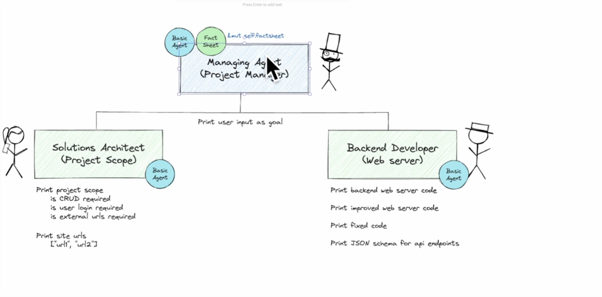
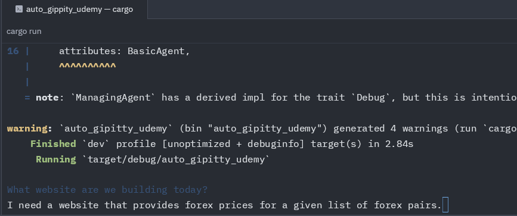
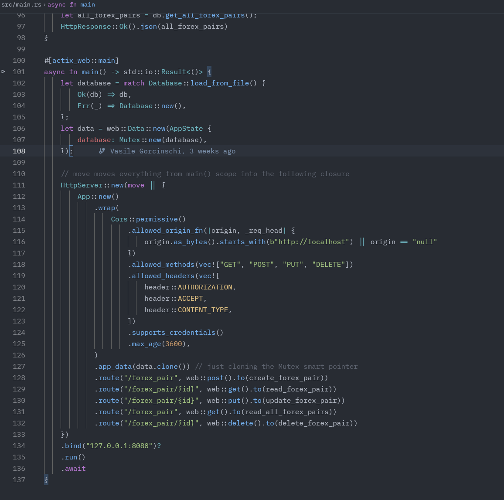
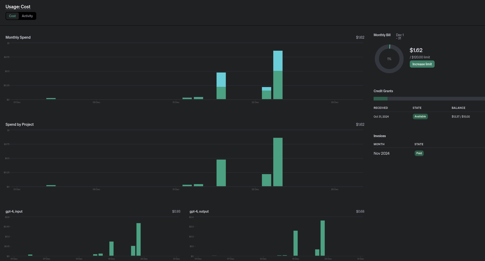

# Auto-Gippity

This is a walk-through of the [Build an AutoGPT Code Writing AI Tool With Rust and GPT-4](https://www.udemy.com/course/autogpt-gpt4-code-writing-ai) Udemy course.

This project consists of three agents, performing different tasks:

1. Managing agent - manages a solutions' architect
2. Solutions' architect
3. Backend Developer

Agents can call LLMs (Large Language Models) and get back some results.

This program takes user input from command line.

## Agents

All agents have an underlying `BasicAgent` that describes their behaviour. Managing agent holds
_fact sheets_ - information that agents need in order to process the task at hand.

Please check the diagram below to see the relationship between three agents:



## Fact sheet

This holds the following information:

|        Fact         |        Owner        |
| :-----------------: | :-----------------: |
| Project description |   Project manager   |
|    Project scope    | Solutions architect |
|    External urls    | Solutions architect |
|    Backedn code     |  Backend developer  |
| API Endpoint schema |  Backend developer  |

## Runbook

Currently you will have to have `rust` installed and run `cargo run` from the root of the project, or
you may run `cargo build --release` and run the native binary compiled for your OS' architecture
like such: `./target/release/auto_gippity_udemy`.

When prompted, describe what is the website that you would like Auto-Gippity to build:



The result should then be a functional application that:

- compiles
- passes functional testing

Here is a glimpse of what the generated code looks like:



Code is currently hard coded to be saved into a local (siebling) repository named `web_template_autogpt`,
this can, again, be further improved in the future to create a new repository, push to it, compile and
publish to AWS CodeArtifact (or wherever), and actually deploy into a cloud.

### Unit testing

Running the project as is, as well as running some unit test will deduct funds from your OpenAI API budget:



Note that to avoid incurring costs, most of the unit test have this configuration annotation: `#[cfg(feature = "openai-coverage")]`.
If you explicitly want to run test that will charge your OpenAI account, execute those tests as follows (change your actual test name accordingly):

```shell
cargo test test_writing_backend_code --features openai-coverage -- --nocapture
```

## Potential feature improvements

Here are some feature improvements:
- [ ] Use actix' actor model for the design of [Agents](https://actix.rs/docs/actix/actor/)
- [ ] Use alternative LLM backends (not OpenAI's only)
- [ ] Develop a free-off charge, less performant LLM backend alternative, perhaps having developed [one](https://www.amazon.ca/dp/1633437167) yourself
- [ ] Build artifacts for most popular Linux distros (`.deb`, `.rpm`), maybe even for MacOS or Windows executables to run this project. Package them upon a Git release.
- [ ] Store output websites in a new directory every time with resources and config files
- [ ] Read template from a configurable link to a Git repo. This could be passed via standard input, or a file
- [ ] Push output binary to GCP Registry/AWS CodeArtifact/Azure Artifacts
- [ ] Deploy the website based on a provided cloud credentials
- [ ] Add a Frontend Agent (this would require providing a frontend template)
- [ ] Introduce chain-of-thought prompting, see this [paper](https://arxiv.org/abs/2201.11903) for details
- [ ] Think through testing dynamic API routes (only static routes are supported for now)
- [ ] Have LLM ask additional questions as to the goals that a user is trying to achieve with their website - a Discovery Agent
